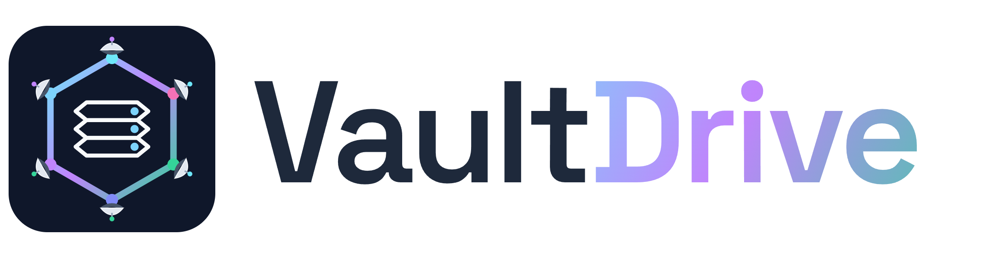

<p align="center"></p>

# VaultDrive — official releases

**VaultDrive** is decentralized, self-hosted file storage: a
[Holochain](https://holochain.org) app that keeps your files on infrastructure
**you** own — your own device or your always-on
[Vault Node](https://github.com/markCCGnomes/vault-node-releases) — instead of a
third-party cloud. It is the file store of the Vault ecosystem: **DataFerry**
form attachments and PDF receipts upload straight to your node, and other apps
(VaultForm, Parley, VaultDocs) reference the stored files by portable
`VaultFileRef`s rather than copying bytes around.

This repository hosts the **official release artifacts** (source is maintained
privately by CCGnomes):

| Asset | What it is |
|---|---|
| `vaultdrive.happ` | The Holochain app bundle every device and Vault Node installs |
| `vault-node.manifest.json` | Lockstep manifest a Vault Node verifies before install |
| `vaultdrive-http-api-x86_64-linux` | The HTTP API sidecar (port 2342) that DataFerry uploads to |

## Install

The easy path is a Vault Node: flash a
[Vault Node image](https://github.com/markCCGnomes/vault-node-releases), then
enable VaultDrive on it — the node fetches and verifies the artifacts above
automatically. Enabling VaultForm + VaultDrive together is the standard
"DataFerry full stack": form data lands in VaultForm, file attachments land in
VaultDrive. Point DataFerry's VaultDrive endpoint at your node and you're done.

Manual/advanced setups: see each release's notes. All artifacts on a given
release tag are **lockstep** — install the `.happ` and the sidecar binary from
the *same tag*, never mix versions.

## Verify your download

Each release's `vault-node.manifest.json` contains the SHA-256 of the exact
`.happ` bytes (`happ_sha256`). Vault Nodes check this automatically; manual
installs can too:

```bash
sha256sum vaultdrive.happ   # must match happ_sha256 in vault-node.manifest.json
```

## License & donations

Free for personal **and** commercial use, self-hosted. Not for redistribution,
modification, or offering as a hosted service to third parties — see
[LICENSE](LICENSE). VaultDrive is community-funded: if it's useful to you,
donations toward continued development are warmly encouraged at
**https://ccgnomes.com/donate**.

## Security

Please report vulnerabilities privately via this repository's
"Report a vulnerability" button (GitHub private vulnerability reporting) rather
than a public issue.

---

<p align="center">
  <br/>
  VaultDrive is part of the <strong>VaultSuite</strong> family &mdash;
  <a href="https://github.com/markCCGnomes/reelvault-releases">ReelVault</a> &middot;
  <a href="https://github.com/markCCGnomes/vaultdocs-releases">VaultDocs</a> &middot;
  <a href="https://github.com/markCCGnomes/vaultform-releases">VaultForm</a> &middot;
  <a href="https://github.com/markCCGnomes/vault-node-releases">Vault Node</a> &middot;
  <a href="https://github.com/markCCGnomes/vault-flasher-releases">Vault Flasher</a>
</p>
